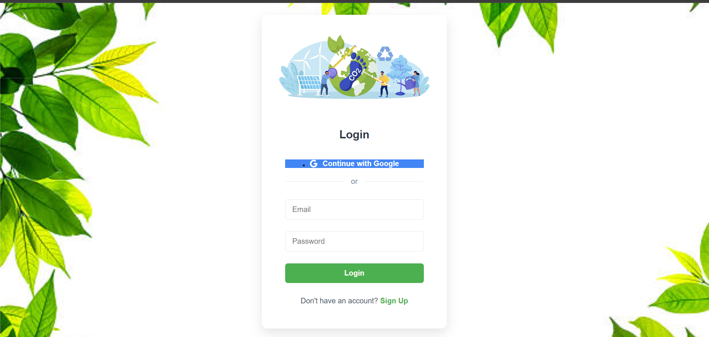
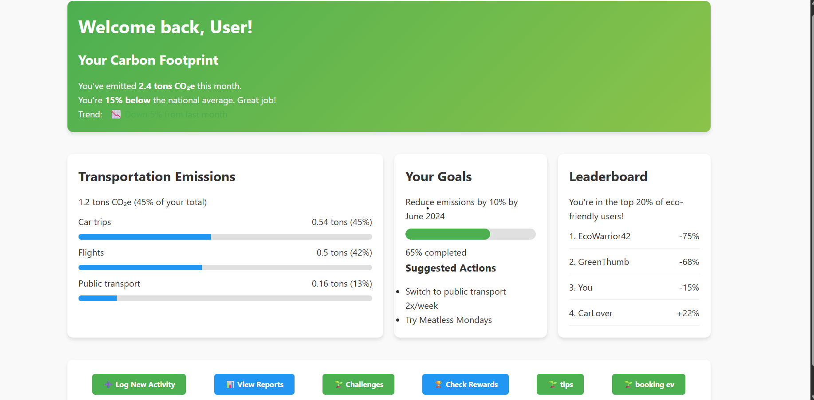
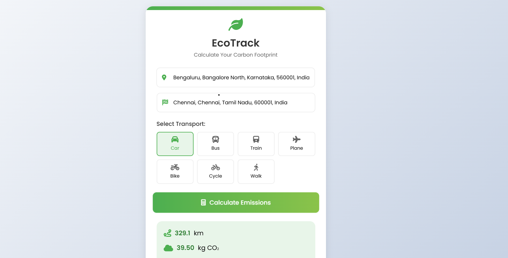
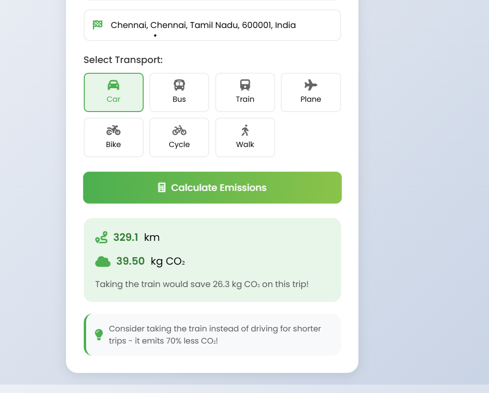
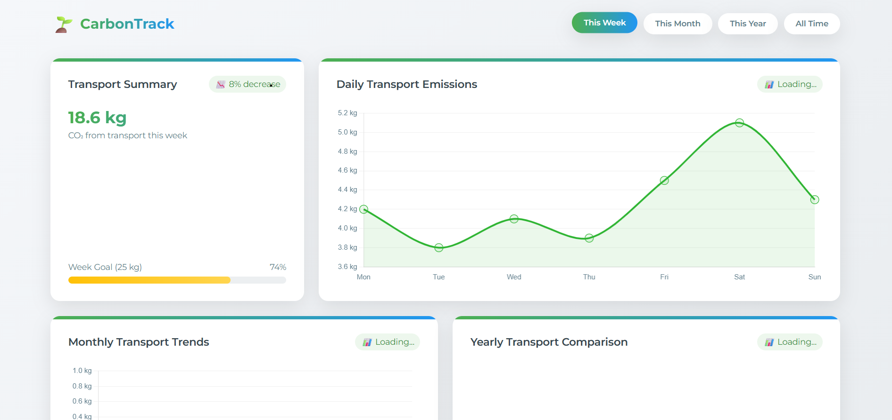
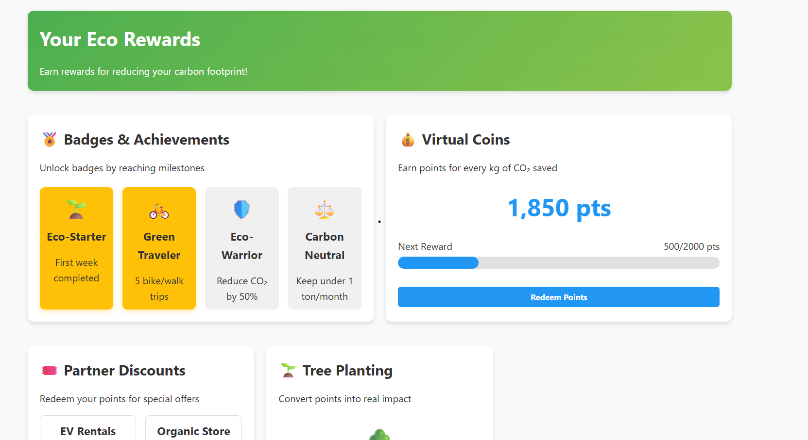
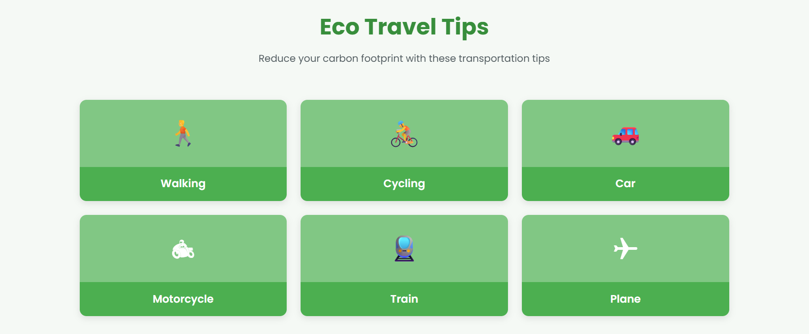
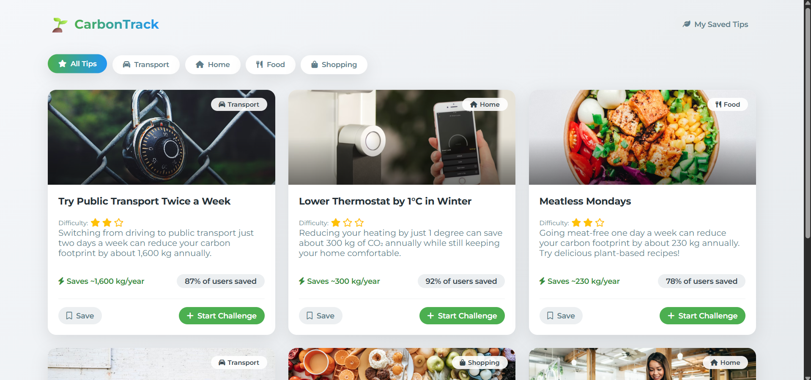
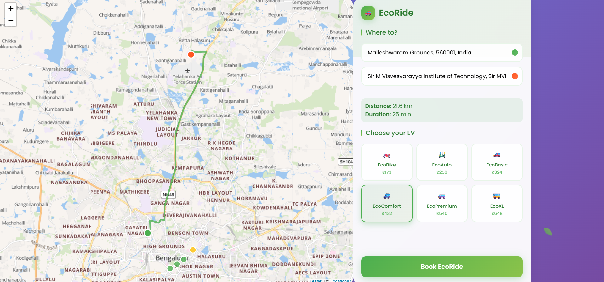

# EcoTrack – Sustainable Travel & EV Booking Platform

**EcoTrack** is a web-based application designed to promote sustainable travel through CO₂ tracking, rewards for eco-friendly habits, and EV vehicle booking features.

## 🌱 Features

- **CO₂ Emission Dashboard:** Visualizes users' travel-related emissions and reductions.
- **EV Booking System:** Allows users to choose eco-friendly electric vehicles for their journeys.
- **Progress & Rewards:** Tracks user behavior and incentivizes with rewards for sustainable choices.
- **Tips & Awareness:** Provides eco-friendly travel tips to educate and encourage greener behavior.
- **Login & Personalization:** Users can register, log in, and view personalized dashboards.

## 🛠️ Tech Stack

- **Backend:** FastAPI (Python)
- **Frontend:** HTML, CSS, JavaScript
- **Templating:** Jinja2
- **Deployment:** Easily deployable with `uvicorn` or any ASGI server

## 🙌 Contributors

| Name           | GitHub Profile                     |
|----------------|-------------------------------------|
| Kesavan        | [Kesavan710](https://github.com/Kesavan710)         |
| Rohan Hiremath | [rohanhiremath](https://github.com/rohanhiremath)       |
| Suraj K S      | [surajks](https://github.com/Suraj-Khatokar)                   |
| Venu R         | [Venu-R](https://github.com/Venu-R)                       |

# Project Name

## Screenshots

### Login page

### Dashboard

### Ecotrack

### Progress

### Rewards

### Tips

### Challenges

### Booking section

